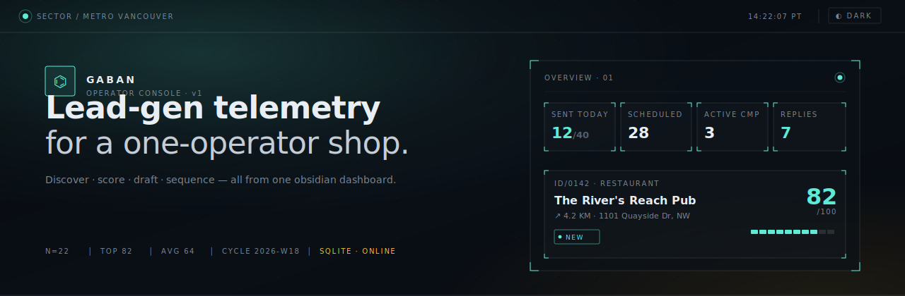

<p align="center">
  
</p>

<h1 align="center">Gaban · Lead Operator Console</h1>

<p align="center">
  <em>Five-phase lead-generation pipeline + a single-operator outreach console</em><br/>
  Built for <a href="https://gleampro.ca">Gleam Pro Cleaning</a> — Metro Vancouver.
</p>

<p align="center">
  
  
  
  
</p>

---

## What it does

Each week (or on demand) Gaban runs a five-phase pipeline that:

1. **Discovers** local businesses for a category list via Outscraper / Google Maps.
2. **Filters** them by distance, business status, and a dedupe ledger of previously seen places.
3. **Scores** the survivors with an OpenAI prompt against six weighted factors (size signals, cleanliness pain, location, online presence, business age, no current cleaner) — capped to a top-N.
4. **Drafts** three outreach styles per lead (curious neighbor / value lead / compliment question) with both an email body and a DM variant.
5. **Exports** the result into a local SQLite store (with a CSV fallback) that powers a Next.js operator console: scoring breakdowns, outreach editor, sequence scheduler, suppression list, send queue, response monitor, and weekly heartbeat dashboard.

The web UI is the **Halon** operator console — a refined cyber-instrumentation aesthetic (Manrope + Azeret Mono, hairline frames with corner brackets, plasma-mint accent on dark / deep-teal on light) with first-class light/dark mode.

---

## Quick start

```bash
# 1 · install
npm install

# 2 · environment (.env)
cp .env.example .env   # fill OUTSCRAPER_API_KEY, OPENAI_API_KEY, GMAIL_* …

# 3 · run the pipeline once
npm start              # node src/cli/run.js

# 4 · launch the operator console
npm run dev            # next dev src/web -p 3010
# → http://localhost:3010   (login PIN required)
```

`npm test` runs the full suite (145 tests, ~2s).

---

## Architecture

```
                 ┌─────────────────┐
   Outscraper ──▶│  1. Discovery    │
                 ├─────────────────┤
   seen_leads ──▶│  2. Filtering    │
                 ├─────────────────┤
   OpenAI    ───▶│  3. Scoring      │
                 ├─────────────────┤
   OpenAI    ───▶│  4. Drafting     │
                 ├─────────────────┤
   SQLite ◀──────│  5. Export       │──▶ CSV fallback
                 └────────┬────────┘
                          ▼
                  ┌────────────────┐
                  │  Next.js web   │ ← Gmail send queue, response monitor,
                  │  (Halon UI)    │   heartbeat, schedules, outcomes
                  └────────────────┘
```

| Layer       | Where                      | Notes                                            |
|-------------|----------------------------|--------------------------------------------------|
| CLI         | `src/cli/run.js`           | Single entrypoint; `--config <json>` overrides. |
| Services    | `src/services/`            | One class per concern (discovery, scoring, …). |
| Web app     | `src/web/app/`             | Next.js 16 (App Router, Turbopack).             |
| UI tokens   | `src/web/app/globals.css`  | Halon design system + Tailwind bridge.          |
| Storage     | `data/gaban.sqlite`        | better-sqlite3, schema in `src/web/lib/db.js`.  |

---

## Operator console

Eight sections, all sharing the Halon design language:

- `01 / OVERVIEW` — sent today, scheduled, replies, system telemetry.
- `02 / WEEKLY` — current cycle's leads, sortable, with segmented score meters.
- `03 / HISTORY` — past cycles, filterable.
- `04 / CAMPAIGNS` — sequences, send queues, outcome forms.
- `05 / RESPONSES` — replies, bounces, unsubscribes.
- `06 / OUTCOMES` — meetings, contracts, dispositions.
- `07 / RUNS` — pipeline run logs, cancel + tail.
- `08 / USAGE` — token / API spend.
- `09 / SETTINGS` — presets, schedules, suppressions.

Every page lives at `src/web/app/(app)/<section>/page.tsx`; the layout (`(app)/layout.tsx`) injects the side rail, top status bar, and the live theme toggle.

---

## Scripts

| Script                | What                                              |
|-----------------------|---------------------------------------------------|
| `npm start`           | Run the pipeline once.                            |
| `npm test`            | Node test runner (145 tests).                     |
| `npm run test:watch`  | Watch mode.                                       |
| `npm run dev`         | Next dev server on `:3010`.                       |
| `npm run build:web`   | Production Next build.                            |
| `npm run start:web`   | Production Next server on `:3010`.                |
| `npm run dev:pipeline`| `node --watch` of the pipeline (for local dev).   |
| `npm run seed`        | Seed initial presets / system settings.           |

Standalone helpers in `scripts/`:

- `import-leads-csv.mjs` — recover a fallback CSV into SQLite.
- `microsoft-auth-url.mjs` / `microsoft-exchange-code.mjs` — Outlook OAuth flow.
- `start-cloudflared-tunnel.ps1`, `start-bot-web.ps1`, `install-startup-tasks.ps1` — Windows service wiring.

---

## Configuration

Pipeline behavior comes from `src/config/settings.json` and can be overridden per-run:

```bash
node src/cli/run.js --config /path/to/override.json
```

Override shape:

```json
{
  "search":           { "location": "New Westminster, BC", "radius_km": 12 },
  "office_location":  { "lat": 49.20, "lng": -122.91 },
  "categories":       ["restaurants", "cafes"],
  "scoring":          { "top_n": 5 }
}
```

Environment variables (see `.env.example`):

- `OUTSCRAPER_API_KEY`, `OPENAI_API_KEY` — required.
- `GMAIL_CLIENT_ID`, `GMAIL_CLIENT_SECRET`, `GMAIL_REFRESH_TOKEN` — outreach send.
- `GOOGLE_SHEETS_CREDENTIALS` — optional Sheets export.
- `WEB_PIN` — operator console login.

---

## Design system — "Halon"

| Token       | Light         | Dark          |
|-------------|---------------|---------------|
| `--bg`      | `#ECE6D8`     | `#06090E`     |
| `--surface` | `#F5F1E6`     | `#0C1117`     |
| `--ink`     | `#0C0F14`     | `#E8EEF4`     |
| `--accent`  | `#0E7A68` (deep teal) | `#5EEAD4` (plasma mint) |
| `--warn`    | `#B85B12`     | `#FBBF24`     |
| `--danger`  | `#9F1C1C`     | `#F87171`     |

Type stack: **Manrope** for UI/headings, **Azeret Mono** for telemetry labels and numerics. Loaded via `<link>` in `app/layout.tsx`. Theme is persisted in `localStorage` under `halon.theme` and applied pre-paint by `public/theme-init.js` to avoid FOUC.

Primitive classes (in `globals.css`):

```text
.frame   .frame--brackets   .label   .numeric   .tag   .tag--accent
.tag--warn   .tag--danger   .tag--mute   .btn   .btn--primary
.field   .nav-link   .pulse-dot   .meter   .boot   .hr-fade
```

A Tailwind utility bridge in the same file retargets `bg-white`, `bg-gray-*`, `text-gray-*`, `border-gray-*`, and brand-color classes onto Halon tokens, so any unconverted page still themes correctly.

---

## Data

All persistent state lives in `data/gaban.sqlite`. Schema is created on first boot from `src/web/lib/db.js` — key tables:

- `leads`, `outreach_drafts`, `lead_notes`
- `campaigns`, `campaign_leads`, `email_sends`, `email_events`
- `presets`, `schedules`, `suppressions`
- `pipeline_runs` (with streaming logs)

Daily backups are written to `data/backups/YYYY-MM-DD.sqlite` by `BackupService` on web boot.

---

## Testing

```bash
npm test            # full suite, ~2s
npm run test:watch  # iterate
```

Tests cover every service (discovery, filtering, scoring, drafting, sqlite, sheets, gmail, send queue, sequence scheduler, suppression, warm-up cap, unsubscribe tokens, response monitor, heartbeat, healthcheck, …) plus the CLI `run.js` end-to-end with mocked clients.

---

## License

Private project — internal to Gleam Pro Cleaning.
