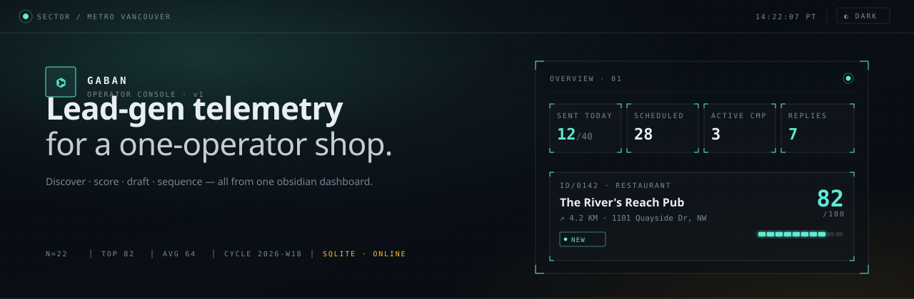

<p align="center">
  
</p>

<h1 align="center">Gaban · Lead Operator Console</h1>

<p align="center">
  <em>Five-phase lead-generation pipeline + a single-operator outreach console</em><br/>
  Built for <a href="https://gleampro.ca">Gleam Pro Cleaning</a> — Metro Vancouver.
</p>

<p align="center">
  
  
  
  
  
</p>

---

## What it does

Each week (or on demand) Gaban runs a five-phase pipeline that:

1. **Discovers** local businesses for a category list via Outscraper / Google Maps. Categories come from the preset, or from a four-week rotation when the preset doesn't pin them.
2. **Filters** them by distance, business status, chain membership, contact presence, and a dedupe ledger of previously seen places — then enriches survivors with email addresses scraped from their own websites.
3. **Scores** the survivors with an OpenAI prompt against six weighted factors — size signals (20), cleanliness pain (20), location (15), online presence (15), business age (15), no current cleaner (15) — capped to a top-N.
4. **Drafts** a five-touch cold-email sequence per lead, each touch with an email subject, body, and a DM variant. Touch 1 comes in two arms (poke + walkthrough offer, or a plain routing question) so the opener can be A/B tested.
5. **Exports** the result into a local SQLite store (with a CSV fallback) that powers a Next.js operator console: scoring breakdowns, outreach editor, sequence scheduler, send calendar, suppression list, send queue, response monitor, open tracking, and weekly heartbeat dashboard.

The web UI is the **Halon** operator console — a refined cyber-instrumentation aesthetic (Manrope + Azeret Mono, hairline frames with corner brackets, plasma-mint accent on dark / deep-teal on light) with first-class light/dark mode.

---

## Quick start

```bash
# 1 · install
npm install

# 2 · environment (.env)
cp .env.example .env   # fill OUTSCRAPER_API_KEY, OPENAI_API_KEY, GMAIL_OAUTH_* …

# 3 · seed presets + system settings
npm run seed

# 4 · run the pipeline once
npm start              # node src/cli/run.js

# 5 · launch the operator console
npm run dev            # next dev src/web -p 3010
# → http://localhost:3010   (login PIN required)
```

`npm test` runs the full suite (282 tests across 39 suites, ~3s).

For the full stack in one terminal — web + background worker + Cloudflare tunnel, with a live status dashboard — use `npm run dev:all` (or `npm run start:all` in production, after `npm run build:web`).

---

## Architecture

```
                 ┌─────────────────┐
   Outscraper ──▶│  1. Discovery    │
                 ├─────────────────┤
   seen_leads ──▶│  2. Filtering    │──▶ website email enrichment
                 ├─────────────────┤
   OpenAI    ───▶│  3. Scoring      │
                 ├─────────────────┤
   OpenAI    ───▶│  4. Drafting     │   (5-touch sequence)
                 ├─────────────────┤
   SQLite ◀──────│  5. Export       │──▶ CSV fallback
                 └────────┬────────┘
                          ▼
         ┌────────────────┴────────────────┐
         ▼                                 ▼
 ┌────────────────┐               ┌────────────────┐
 │  Next.js web   │               │  Background    │
 │  (Halon UI)    │◀── SQLite ───▶│  worker        │
 └────────────────┘               └────────────────┘
   operator console                 send queue, response monitor,
   + public tracking/               health checks, backups, cron
     unsubscribe endpoints          schedules, finalize sweep
```

| Layer       | Where                      | Notes                                            |
|-------------|----------------------------|--------------------------------------------------|
| CLI         | `src/cli/run.js`           | Single entrypoint; `--config <json>` overrides.  |
| Services    | `src/services/`            | One module per concern (discovery, scoring, …).  |
| Worker      | `src/worker/background.js` | Long-running: cron schedules + queue processing. |
| Web app     | `src/web/app/`             | Next.js 16 (App Router, Turbopack).              |
| UI tokens   | `src/web/app/globals.css`  | Halon design system + Tailwind bridge.           |
| Storage     | `data/gaban.sqlite`        | better-sqlite3, schema in `src/web/lib/db.js`.   |

Route groups under `src/web/app/`:

- `(app)/` — the authenticated operator console.
- `(auth)/login` — PIN login.
- `(marketing)/` — public `/product`, `/docs`, `/support` pages.
- `u/[token]` — public one-click unsubscribe landing page.
- `api/` — console APIs plus the public `api/unsubscribe/` and `api/track/` endpoints.

---

## Operator console

Twelve sections, all sharing the Halon design language (order and codes come from `src/web/components/SideNav.tsx`):

- `01 / OVERVIEW` (`/dashboard`) — sent today, scheduled, replies, system telemetry.
- `02 / WEEKLY` (`/`) — current cycle's leads, sortable, with segmented score meters.
- `03 / HISTORY` — past cycles, filterable.
- `04 / CAMPAIGNS` — sequences, send queues, per-touch status and open badges, outcome forms.
- `05 / PREVIEW` — render a real outreach message end to end, footer and all, before it ships.
- `06 / TODAY` — the day's send list.
- `07 / CALENDAR` — scheduled sends laid out across the runway.
- `08 / RESPONSES` — replies, bounces, auto-replies, unsubscribes.
- `09 / OUTCOMES` — meetings, contracts, dispositions.
- `10 / RUNS` — pipeline run logs, cancel + tail.
- `11 / USAGE` — token / API spend.
- `12 / SETTINGS` — presets, schedules, outreach safety, suppressions.

Every page lives at `src/web/app/(app)/<section>/page.tsx`; the layout (`(app)/layout.tsx`) injects the side rail, top status bar, and the live theme toggle. Lead detail lives at `/leads/[id]`.

---

## Outreach

Sending is driven by the background worker, not the web request cycle.

- **Sequence** — five touches per lead (touch 1 in two arms, then 2 / 3 / 4), scheduled by `sequenceScheduler` and dispatched by `sendQueueWorker` through Gmail.
- **Safety rails** — a global daily cap or a warm-up ladder (`warmupCapService`), a suppression list checked on every send, recipient validation, and auto-reply handling that can either continue or cancel the remaining sequence.
- **CASL footer** — every message carries the registered business identity, mailing address, the reason for contact, and a signed one-click unsubscribe link (`unsubscribeTokenService`, HMAC over `UNSUBSCRIBE_TOKEN_SECRET`).
- **Open tracking** — optional, off by default, toggled at **Settings → Outreach Safety → Open Tracking**. When on, outgoing mail carries a 1×1 pixel pointing at `/api/track/o/<token>.gif` and the footer discloses it in plain language. Pixel tokens are purpose-tagged, so one scraped out of an email body cannot be replayed against the unsubscribe endpoint. The endpoint always returns the image — never a 404 — so a prober learns nothing from a bad token. Scanner prefetches (known gateway user agents, or a fetch within 2s of send) are recorded but flagged as machine opens and kept out of the human open count.
- **Response monitor** — `emailResponseMonitor` polls the mailbox and classifies replies, bounces, and auto-replies into `email_events`.
- **Metrics** — `metricsService` reports sends, replies, bounces, unsubscribes, and opens (counted per send, never per pixel fetch) by template, touch, and vertical.

---

## Scripts

| Script                | What                                              |
|-----------------------|---------------------------------------------------|
| `npm start`           | Run the pipeline once.                            |
| `npm test`            | Node test runner (282 tests).                     |
| `npm run test:watch`  | Watch mode.                                       |
| `npm run dev`         | Next dev server on `:3010`.                       |
| `npm run dev:all`     | Web + worker + Cloudflare tunnel in one terminal with a live status dashboard (dev mode). |
| `npm run build:web`   | Production Next build.                            |
| `npm run start:web`   | Production Next server on `:3010`.                |
| `npm run start:worker`| Background worker (send queue, response monitor, health checks, backups, cron schedules, finalize sweep). |
| `npm run start:all`   | Web + worker + Cloudflare tunnel in one terminal with a live status dashboard (prod; run `build:web` first). |
| `npm run dev:pipeline`| `node --watch` of the pipeline (for local dev).   |
| `npm run seed`        | Seed initial presets / system settings.           |

Standalone helpers in `scripts/`:

- `start-all.mjs` — single-terminal supervisor: starts web + worker + Cloudflare tunnel, streams each to `logs/`, and shows a live ✓/✗ status dashboard (`npm run start:all` / `dev:all`).
- `await-services.mjs` — block until web + worker are answering; used by the supervisor and the scheduled tasks.
- `import-leads-csv.mjs` — recover a fallback CSV into SQLite.
- `redraft-active.mjs` — regenerate drafts for leads in active campaigns after a prompt change.
- `scrub-draft-locations.mjs` — strip sender-location / proximity claims from existing drafts.
- `smoke-send.mjs` — send one real message end to end to verify the mail path.
- `send-test-touches.mjs` — send the full touch sequence to yourself for review.
- `send-volume-reminder.mjs` — nudge for the volume schedule in `docs/outreach-volume-schedule.md`.
- `microsoft-auth-url.mjs` / `microsoft-exchange-code.mjs` — Outlook OAuth flow.
- `start-bot-web.ps1`, `start-bot-worker.ps1`, `start-cloudflared-tunnel.ps1`, `watch-cloudflared-tunnel.ps1`, `restart-all.ps1`, `install-startup-tasks.ps1`, `uninstall-startup-tasks.ps1` — Windows scheduled-task wiring (runs the same three services headless at logon).

---

## Configuration

Pipeline behavior comes from `src/config/settings.json` and can be overridden per-run:

```bash
node src/cli/run.js --config /path/to/override.json
```

Override shape:

```json
{
  "search":           { "location": "New Westminster, BC", "radius_km": 50 },
  "office_location":  { "lat": 49.2026, "lng": -122.9106 },
  "categories":       ["restaurants", "cafes"],
  "enrichment":       { "enabled": true, "website_email_lookup": true },
  "scoring":          { "model": "gpt-5-mini", "top_n": 10 },
  "drafting":         { "model": "gpt-5-mini" }
}
```

Categories live in `src/config/categories.js`: a four-week rotation (`restaurants`/`offices` → `clinics`/`gyms` → `schools`/`retail stores` → `community centers`/`industrial facilities`) plus `ADDITIONAL_CATEGORIES` (`spa`, `physiotherapy`) that presets can select on demand but that never enter the automatic rotation.

Operational settings that change between runs — daily cap, warm-up ladder and start date, auto-reply action, open tracking — live in the `system_settings` table and are edited from the Settings page, not from JSON.

Environment variables (see `.env.example`):

| Variable | Purpose |
|----------|---------|
| `OUTSCRAPER_API_KEY`, `OPENAI_API_KEY` | Required — discovery, scoring, drafting. |
| `APP_PIN`, `APP_SECRET` | Operator console login and session signing. |
| `GMAIL_OAUTH_CLIENT_ID`, `GMAIL_OAUTH_CLIENT_SECRET`, `GMAIL_OAUTH_REFRESH_TOKEN` | Outreach send + response monitor. |
| `GMAIL_SENDER_EMAIL`, `GMAIL_SENDER_NAME` | From-header identity. |
| `UNSUBSCRIBE_TOKEN_SECRET` | HMAC secret for unsubscribe and open-tracking tokens. |
| `PUBLIC_APP_URL` | Base for unsubscribe and tracking-pixel links. |
| `BUSINESS_LEGAL_NAME`, `BUSINESS_OPERATING_NAME`, `BUSINESS_MAILING_ADDRESS` | CASL footer identity. |
| `BUSINESS_SENDER_NAME`, `BUSINESS_SENDER_ROLE`, `BUSINESS_SENDER_PHONE`, `BUSINESS_SENDER_WEBSITE` | Signature block above the footer. |
| `GOOGLE_SHEETS_CREDENTIALS`, `GOOGLE_SHEETS_SPREADSHEET_ID` | Optional Sheets export. |
| `LOG_LEVEL`, `DRY_RUN` | Optional overrides. |

---

## Design system — "Halon"

| Token       | Light         | Dark          |
|-------------|---------------|---------------|
| `--bg`      | `#ECE6D8`     | `#06090E`     |
| `--surface` | `#F5F1E6`     | `#0C1117`     |
| `--elev`    | `#FBF8EF`     | `#11171F`     |
| `--ink`     | `#0C0F14`     | `#E8EEF4`     |
| `--accent`  | `#0E7A68` (deep teal) | `#5EEAD4` (plasma mint) |
| `--warn`    | `#B85B12`     | `#FBBF24`     |
| `--danger`  | `#9F1C1C`     | `#F87171`     |

Type stack: **Manrope** for UI/headings, **Azeret Mono** for telemetry labels and numerics. Loaded via `<link>` in `app/layout.tsx`. Theme is persisted in `localStorage` under `halon.theme` and applied pre-paint by `public/theme-init.js` to avoid FOUC.

Primitive classes (in `globals.css`):

```text
.frame   .frame--brackets   .label   .numeric   .tag   .tag--accent
.tag--warn   .tag--danger   .tag--mute   .btn   .btn--primary
.field   .nav-link   .pulse-dot   .meter   .boot   .hr-fade
```

A Tailwind utility bridge in the same file retargets `bg-white`, `bg-gray-*`, `text-gray-*`, `border-gray-*`, and brand-color classes onto Halon tokens, so any unconverted page still themes correctly.

---

## Data

All persistent state lives in `data/gaban.sqlite`. Schema is created on first boot from `src/web/lib/db.js` — the tables:

- **Leads** — `leads`, `outreach_drafts`, `lead_notes`
- **Pipeline** — `presets`, `schedules`, `pipeline_runs` (with streaming logs), `lead_run_results`
- **Outreach** — `campaigns`, `campaign_leads`, `email_sends`, `email_events`, `suppression_list`
- **Results** — `meetings`, `contracts`
- **Ops** — `system_settings`, `api_usage_events`

Daily backups are written to `data/backups/YYYY-MM-DD.sqlite` by `BackupService`.

---

## Testing

```bash
npm test            # full suite, ~3s
npm run test:watch  # iterate
```

282 tests across 39 suites cover every service (discovery, filtering, scoring, drafting, sqlite, sheets, gmail, send queue, sequence scheduler, suppression, warm-up cap, unsubscribe and open-tracking tokens, open tracking, metrics, response monitor, heartbeat, healthcheck, backup, startup recovery, …) plus the CLI `run.js` end-to-end with mocked clients.

---

## Docs

Design docs, plans, and runbooks live in `docs/superpowers/`. Start with:

- `runbooks/2026-04-30-outreach-bot-operator-runbook.md` — day-to-day operation.
- `runbooks/2026-04-17-outreach-bot-phase-1-setup.md` — first-time Gmail / OAuth setup.
- `docs/outreach-volume-schedule.md` — the send-volume ramp.

---

## License

Private project — internal to Gleam Pro Cleaning.
